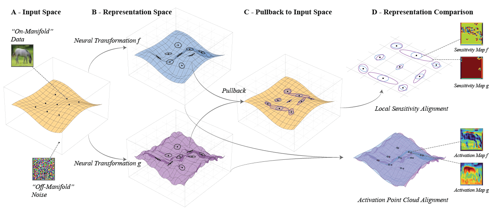

# Neural Sensitivity Geometry

Code accompanying the paper:

**Beyond Activation Alignment: The Geometry of Neural Sensitivity**  
Amirhossein Yavari and Farnaz Zamani Esfahlani

This repository contains the main code for computing dataset-level neural sensitivity summaries, S-RAS comparisons, diagnostic probes, robust-training analyses, and Allen Brain Observatory static-gratings analyses.



## Overview

Activation-alignment methods compare representations through stimulus-evoked activity patterns. This project compares representations through dataset-level local sensitivity summaries: expected projected pullback/Fisher operators over specified perturbation families.

The repository includes notebooks for:

- layer-matching sanity checks and pointwise local-geometry controls;
- class-conditional diagnostic probes;
- robust-training comparisons;
- Allen Brain Observatory static-gratings preprocessing and analysis;
- model training for the computational experiments.

Final manuscript figure assembly/design scripts are not included.

## Repository structure

```text
assets/
  neural_sensitivity_overview.png

Computational Results/
  Experiments/
    architecture_diagnostic_probes_final.ipynb
    layer_matching_sanity_check_final.ipynb
    robust_vs_standard_experiment_final.ipynb
  Training/
    Cifar_training_Resnet_ViT.ipynb
    robust_resnet_training_cifar.ipynb
    Tiny10_Cifar10_Training.ipynb

Mice Results/
  allen_grating_preprocessing.ipynb
  allen_grating_analysis.ipynb
```

## Main paper mapping

| Paper item | Code location |
|---|---|
| Table 1, layer matching | `Computational Results/Experiments/layer_matching_sanity_check_final.ipynb` |
| Figure 2, diagnostic probes | `Computational Results/Experiments/architecture_diagnostic_probes_final.ipynb` |
| Figure 3, robust training | `Computational Results/Experiments/robust_vs_standard_experiment_final.ipynb` |
| Figure 4 and Table 2, Allen static gratings | `Mice Results/allen_grating_preprocessing.ipynb`, `Mice Results/allen_grating_analysis.ipynb` |
| Model training | `Computational Results/Training/` |

## Data

The computational experiments use CIFAR-10. The biological analyses use the Allen Brain Observatory Visual Coding dataset.

Large trained checkpoints, raw datasets, and intermediate analysis outputs are not included in this repository. The notebooks specify the expected directory structure and data locations.

## Environment

Most computational notebooks were run with Python 3.13. The Allen Brain Observatory preprocessing notebook was run with Python 3.11 because of AllenSDK compatibility.

Recommended packages for the computational experiments:

```bash
python >= 3.13
jax
flax
optax
numpy
scipy
scikit-learn
pandas
matplotlib
tqdm
```

Recommended packages for Allen preprocessing and analysis:

```bash
python == 3.11
allensdk
numpy
scipy
scikit-learn
pandas
matplotlib
tqdm
```

Third-party packages are used as external dependencies and are not included in this repository.

## Usage

A typical workflow is:

1. Train or load model banks using notebooks in `Computational Results/Training/`.
2. Run the layer-matching analysis in `Computational Results/Experiments/layer_matching_sanity_check_final.ipynb`.
3. Run the diagnostic-probe analysis in `Computational Results/Experiments/architecture_diagnostic_probes_final.ipynb`.
4. Run the robust-training comparison in `Computational Results/Experiments/robust_vs_standard_experiment_final.ipynb`.
5. Run Allen preprocessing and analysis using the notebooks in `Mice Results/`.

## Notes

Some notebooks contain optional configurations beyond the main reported experiments. Unless otherwise stated, the submitted paper reports CIFAR-10 computational experiments and Allen Brain Observatory static-gratings biological analyses.

Final manuscript figure assembly/design scripts are not included. The notebooks provide the main analysis and experimental code used to generate the reported results.

## Citation

```bibtex
@article{yavari2026neural,
  title={Beyond Activation Alignment: The Geometry of Neural Sensitivity},
  author={Yavari, Amirhossein and Zamani Esfahlani, Farnaz},
  year={2026}
}
```

## License

This repository is released under the MIT License. See `LICENSE` for details.